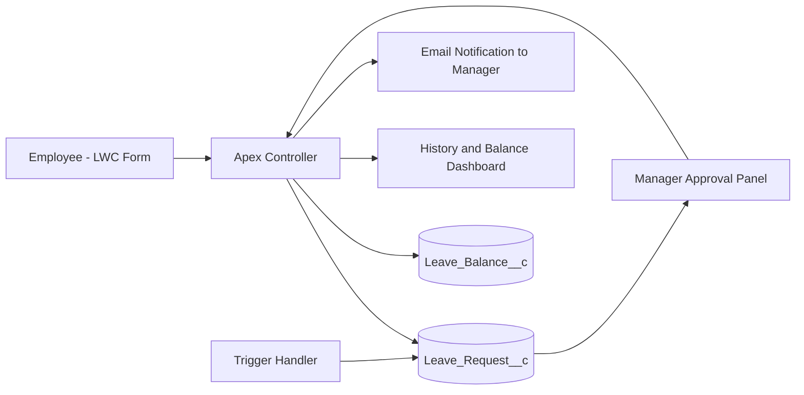

# Leave Management | Salesforce LWC App

[](https://developer.salesforce.com/tools/vscode/)
[](https://developer.salesforce.com/docs/component-library/documentation/en/lwc)
[](https://developer.salesforce.com/docs/atlas.en-us.apexcode.meta/apexcode/)
[](https://github.com/salesforce/sfdx-lwc-jest)

A production-style employee leave workflow application built on Salesforce.
It includes self-service leave application, real-time balance visibility, manager approval actions, and backend validation using Apex.

## Why This Project Stands Out

- End-to-end workflow: employee request -> manager decision -> balance update
- Clear domain modeling with custom objects for requests and balances
- Strong business-rule enforcement in Apex and trigger layer
- Usable UI split into focused LWC modules
- Developer-ready tooling: linting, formatting, unit tests, and pre-commit hooks

## Table of Contents

- [Feature Highlights](#feature-highlights)
- [Architecture](#architecture)
- [Tech Stack](#tech-stack)
- [Data Model](#data-model)
- [Project Structure](#project-structure)
- [Quick Start](#quick-start)
- [Deployment](#deployment)
- [Testing and Code Quality](#testing-and-code-quality)
- [Business Rules Implemented](#business-rules-implemented)
- [Usage Journey](#usage-journey)
- [Roadmap](#roadmap)

## Feature Highlights

- Leave application form with validation and toast-based UX feedback
- Leave history dashboard with withdrawal action
- Balance grid for leave type visibility (total, used, available)
- Manager approval panel with approve/reject actions
- Automatic day calculation and request defaulting via trigger handler
- Email notification to manager on new leave submission

## Architecture



## Tech Stack

- Salesforce DX
- Lightning Web Components
- Apex (controller + trigger handler)
- Custom Objects and Fields
- ESLint + Prettier + Husky
- Jest with sfdx-lwc-jest

## Data Model

### Leave_Request__c

- Employee__c
- Manager__c
- Leave_Type__c
- Start_Date__c
- End_Date__c
- Number_of_Days__c
- Reason__c
- Status__c
- Manager_Comments__c

### Leave_Balance__c

- Employee__c
- Leave_Type__c
- Total_Allocation__c
- Used__c
- Available__c
- Balance_Key__c

## Project Structure

```text
force-app/main/default/
	classes/
		LeaveManagementController.cls
		LeaveRequestTriggerHandler.cls
		LeaveManagementControllerTest.cls
	triggers/
		LeaveRequestTrigger.trigger
	lwc/
		leaveManagementApp/
		leaveApplicationForm/
		leaveHistoryDashboard/
		managerApprovalPanel/
	objects/
		Leave_Request__c/
		Leave_Balance__c/
```

## Quick Start

### 1) Install dependencies

```bash
npm install
```

### 2) Authenticate org

```bash
sf org login web -a LeaveMgmtDev
sf config set target-org=LeaveMgmtDev
```

### 3) Deploy source

```bash
sf project deploy start
```

## Deployment

Use one of the following:

```bash
sf project deploy start
```

Or deploy a specific metadata set:

```bash
sf project deploy start --source-dir force-app
```

## Testing and Code Quality

Run all local quality checks:

```bash
npm run lint
npm run prettier:verify
npm run test:unit
```

Generate LWC coverage:

```bash
npm run test:unit:coverage
```

Run Apex tests:

```bash
sf apex run test --tests LeaveManagementControllerTest --result-format human --wait 10
```

## Business Rules Implemented

- Required request fields: leave type, dates, and reason
- Start date must not be after end date
- Paid leave checks available balance before submit/approve
- Unpaid leave bypasses allocation consumption
- Only assigned manager can process a request
- Only Pending requests can be approved/rejected
- Employee can withdraw Pending or Approved requests
- Approved withdrawal restores consumed balance

## Usage Journey

1. Employee submits leave request.
2. Request lands in Pending state.
3. Manager reviews in approval panel.
4. Manager approves/rejects.
5. Employee sees updated history and balances.

## Roadmap

- Add holiday/weekend-aware leave day calculation
- Add configurable leave policies by profile/department
- Add manager comment prompt modal in UI
- Add richer Apex test coverage for edge cases
- Add CI workflow for lint + tests on pull requests

## Useful References

- Salesforce DX docs: https://developer.salesforce.com/tools/vscode/
- Salesforce CLI reference: https://developer.salesforce.com/docs/atlas.en-us.sfdx_cli_reference.meta/sfdx_cli_reference/
- LWC docs: https://developer.salesforce.com/docs/component-library/documentation/en/lwc
